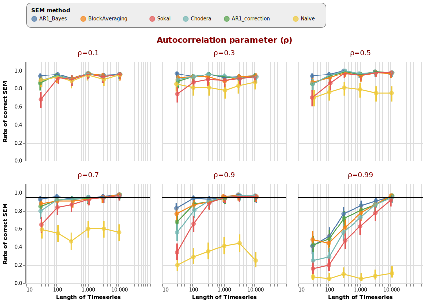
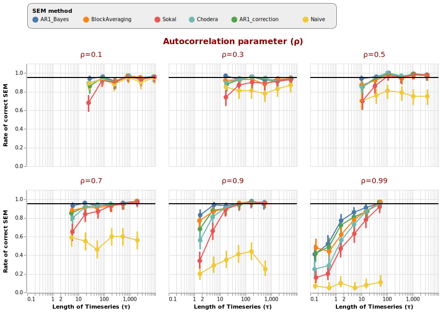

# Calculating confidence intervals for time series (Python)

This project implements and compares several methods for calculating the standard error of the mean estimate (SEM) for stationary time series. Such data can be highly autocorrelated, meaning you don't have as many indendently-sampled measurements as you have actual measurements. Naively calculating the SEM without adjustment for this leads to very small error bars, which often don't contain the actual mean. There's no single 'correct' way to do the adjustment, hence this project comparing several approaches. 

Briefly, the code in `sem_utils.py` has implementations of:

* Naive SEM calculation (bad)
* Block averaging fit to an `arctan` curve (sometimes really bad, mostly good)
* Effective sample size (ESS, a.ka. n<sub>eff</sub>) adjustments based on either Chodera or Sokal (mostly good) 
* Autoregressive AR(1) maximum likelihood ordinary least squares fit combined with an analytical correction factor (mostly good)
* Autoregressive AR(1) Bayesian estimation (mostly good; safest)

Feel free to drop a note in the issues if you'd like to see other techniques compared.


The judgement of which technique is best is of course subjective, and if you know what you're doing then all techniques perform equivalently. If you're not quite sure what you're doing, or not sure if you have enough data compared to the level of autocorrelation, Bayesian estimation using an autoregressive AR(1) model will save you most of the time by factoring in uncertainty. 


# Results

The results show how often the 95% confidence interval actually includes the true mean for each method.   `compare_methods.py` will run a grid comparison of 100 timeseries simulations across several different lengths (`half-log increases of 30, 100, 300, 1000, 3000 timesteps`) combined with several different levels of autocorrelation (`ρ (rho) parameter 0.1, 0.3, 0.5, 0.7, 0.9, 0.99`). `plot.py` uses the Altair library to produce the figures below. 

i.e.:

```
python compare_methods.py
python plot.py
```


## Accuracy of the SEM estimate

At low autocorrelation (ρ = 0.1) all methods get close to the desired 95% rate except for the Sokal technique, which is intended for longer series from MCMC runs. This autocorrelation is so low that you would see it in white noise (which is independent) anyway, meaning the naive SEM also perforoms fine. As ρ increases, naive SEM gets worse and other techniques start to drop off. At ρ=0.9, particularly in cases of small number (n<300) of measurements, most techniques except Bayesian estimation struggle. 


```python
import plot_utils
chart = plot_utils.plot_results_static()
save(chart, 'results_ci.svg')
```




At the highest autocorrelation, ρ=0.99, all techniques struggle. The reason can be seen below. As the ρ parameter increases, the 'integrated autocorrelation time' also increases. Autocorrelation time is the amount of time for a process to 'forget' itself. Another way of seeing it is the time taken to collect one independent sample. Ideally you can sample for many multiples of this time. As shown below, high autocorrelation means we only sampled very small numbers of autocorrelation times. All techniques struggle when they only have less than about 2 autocorrelation times. 

```
chart = plot_utils.plot_results_timeconstant_static()
save(chart, 'results_tau.svg')
```




If your process is very highly autocorrelated, all is not lost. In this case it's helpful to fit either a Bayesian or maximum likelihood AR(1) model - even in cases of high autocorrelation (ρ=0.99) and super low data (30 measurements), which is only ~0.1-0.2 of the autocorrelation time (!), ranges for the estimated ρ parameter include 0.99, indicating to you that more data will be required. The downside is that you would probably need at least two orders of magnitude more data - spanning at least 3000 timesteps.


# Reproduce this data

Use the provided python scripts and conda environment file to install the required packages. Full replication requires this in a bash shell:

```
conda env create -f estimating_sems.yml
conda activate estimating_sems
python compare_methods.py
python plot.py
```


# I want to estimate SEM on my data

Copy the desired function from `sem_utils.py` and use in your workflow - keep in mind these calculate SEM with the named technique, but all return 95% confidence intervals (or credible regions in the Bayesian case), not the SEM. Generate simulated autocorrelated data with `sem_utils.gen_correlated_curve`. 

For example:

```
my_autocorrelated_data = sem_utils.gen_correlated_curve(0.99, 3000)
my_confidence_interval = sem_utils.sem_from_chodera(my_autocorrelated_data)
my_credible_region = sem_utils.sem_from_bayesian_estimation(my_autocorrelated_data)
```


